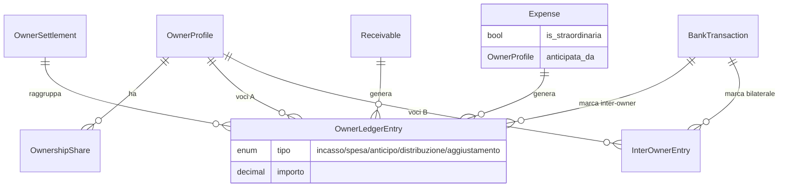

<!-- _class: lead -->

# Viapal — Contabilità tra fratelli

Modello dati e flussi per gestire crediti, debiti e settlement
tra Sandro, Bruna e Fabio (proprietari di Viapal).

---

## Contesto

- Immobile di proprietà di **3 fratelli** con quote `OwnershipShare`
  (~1/3 ciascuno, versionate nel tempo).
- Tutti i flussi (affitti incassati, spese anticipate, conguagli)
  passano da uno solo dei conti, ma economicamente appartengono
  pro-quota a tutti e tre — **cassa virtuale**.
- **Due livelli contabili**:
  - **Livello A** — `OwnerLedgerEntry`: partitario "ufficiale"
    rispetto alla cassa virtuale.
  - **Livello B** — `InterOwnerEntry` / `InterOwnerLoan`: rapporti
    bilaterali privati (prestiti, restituzioni dirette).

---

## Modello dati



---

## Filosofia: tutto a settlement, live calcolato

| Quando si scrive nel partitario A?           | Quando NON si scrive?            |
| -------------------------------------------- | -------------------------------- |
| Settlement annuale (`genera_settlement`)     | Receivable pagato durante l'anno |
| BT marcata inter-owner (atto esplicito)      | Expense anticipata durante l'anno|

- Saldi mostrati nella pagina **Saldi fratelli** sono **calcolati al volo**:
  baseline = ultimo settlement chiuso, + flussi del periodo aperto.
- Niente rumore: 30 spese × 3 fratelli ⇒ 0 voci ledger durante l'anno.
- I settlement chiusi sono **congelati**. Rerun esplicito con `--reset`.

---

## Flusso 1 — Affitto pagato

```
inquilino → conto Bruna  (BT entrata 400€)
                ↓
            Receivable.stato = PAGATO
                ↓
         (NESSUNA voce ledger durante l'anno)
                ↓
      Saldo live di Sandro/Fabio:  +quota·400 (credito su Bruna)
      Saldo live di Bruna:         -(1-quota_B)·400 (debito verso gli altri)
```

A fine anno il `genera_settlement` materializza tutto in voci `INCASSO_AFFITTO`
pro-quota + 1 `AGGIUSTAMENTO` di -400€ per Bruna (versamento alla cassa virtuale).

---

## Flusso 2 — Spesa anticipata da Sandro

```
Sandro paga IMU 1200€ di tasca propria
                ↓
       Expense(anticipata_da=Sandro, importo=1200)
                ↓
         (NESSUNA voce ledger durante l'anno)
                ↓
       Saldo live di Sandro:  +(1-quota_S)·1200  (anticipi pendenti)
       Saldo live di Bruna/Fabio:  -quota·1200   (debito verso Sandro)
```

A settlement: 3 voci `SPESA` pro-quota negative + 1 `ANTICIPO` di +1200 a Sandro
(la cassa rende il di-tasca). Le spese straordinarie (`is_straordinaria=True`)
sono raggruppate separatamente nella descrizione.

---

## Flusso 3 — Settlement annuale

```bash
uv run manage.py genera_settlement --anno 2024
```

- Aggrega Receivable pagati ed Expense del periodo.
- Crea voci `OwnerLedgerEntry` collegate al settlement (somma = 0 per costruzione,
  cassa virtuale chiusa).
- Snapshot finale: `{owner_id: saldo_decimal}`. Eredita come baseline il
  settlement immediatamente precedente.
- **Idempotente**: rerun normale solleva `SettlementGiaEsistente`. Per
  rigenerare, `--reset` (cancella le voci e ricrea).
- `--dry-run` esegue tutto in transazione e fa rollback.

---

## Flusso 4 — BT inter-owner marcata (UX)

Esempi reali sul conto Bruna:

| BT             | Tipo dialog            | Voci create                     |
| -------------- | ---------------------- | ------------------------------- |
| 1707€ "CONGUAGLIO 2025" da Fabio | `incasso_conguaglio`   | 2 `OwnerLedgerEntry` simmetriche |
| 300€ "FABIO RESO" da Fabio       | `bilaterale`           | 1 `InterOwnerEntry` (Livello B) |

Pagina `/p/riconciliazione`: icona `swap_horiz` su ogni BT → dialog →
form con tipo, controparte, descrizione → POST `/api/v1/owner-ledger/bt-inter-owner/`.
Dopo la marcatura, la BT scompare dalla lista riconciliazione (filtro
"Nascondi inter-owner" attivo di default) e ottiene chip "INTER-OWNER".

---

## Cose intenzionalmente fuori scope

- **`WithholdingRule` attiva**: il modello esiste, ma non viene applicato
  (trattenute automatiche su distribuzioni mensili).
- **Distribuzione mensile automatica**: oggi è manuale via dialog
  inter-owner.
- **Ricalcolo retroattivo automatico** su modifica `OwnershipShare`: i
  settlement chiusi sono congelati; si rerun con `--reset`.
- **Pagina di gestione `InterOwnerLoan`**: i prestiti privati sono modellati
  ma non hanno UI dedicata (compaiono solo come `riferimento_loan` nelle
  `InterOwnerEntry`).
- **Esportazione PDF dei settlement chiusi**: solo visualizzazione web.

---

<!-- _class: lead -->

# Grazie

`docs/contabilita-fratelli.md` · build:

```bash
bunx @marp-team/marp-cli docs/contabilita-fratelli.md --pdf
```
